<p align="center">
  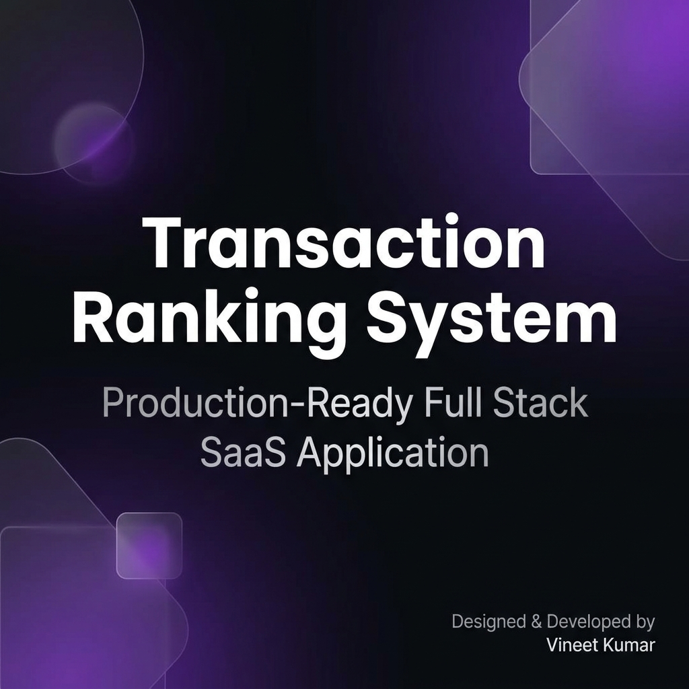
</p>

<p align="center">
  
  
  
  
  
  
  
  
</p>

<h2 align="center">Production-Ready Full Stack SaaS Application</h2>

> **Transaction Ranking System (TRS)** is a high-performance web application that tracks financial transactions, computes multi-factor user scores, and displays live leaderboards. It includes a robust **Admin Panel** for system management, analytics, and audit logging.

---

## 📖 Table of Contents
- [Demo](#-demo)
- [Project Overview](#-project-overview)
- [Features](#-features)
- [Application Preview](#-application-preview)
- [Architecture](#-architecture)
- [Tech Stack](#-tech-stack)
- [Quick Start](#-quick-start)
- [API Documentation](#-api-documentation)
- [Evaluation Access](#-evaluation-access)
- [Developer Information](#-developer-information)

---

## 🎬 Demo

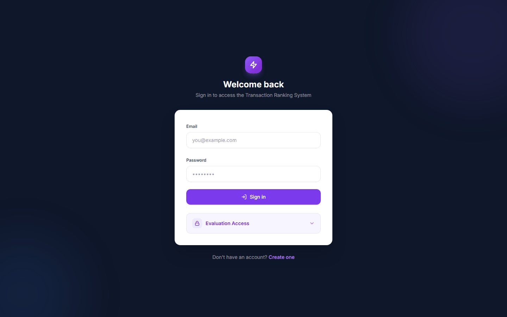

---

## 🌟 Project Overview

Transaction Ranking System is designed as a SaaS platform with role-based authentication (`admin` and `user`). The system securely hashes passwords, utilizes JWTs for API protection, and provides real-time analytical capabilities via Recharts and Framer Motion.

*For detailed insights on the ranking algorithm and system design, please see the [Extended Documentation (EXPLANATION.md)](./EXPLANATION.md).*

---

## 🚀 Features

| User Application | Admin Panel | Security & Infrastructure |
|------------------|-------------|---------------------------|
| 📊 Interactive Dashboard | 📈 Full System Analytics | 🔒 bcrypt Password Hashing |
| 💸 Transaction Management | 👥 User Management & Filtering | 🔑 JWT Bearer Tokens |
| 🏆 Live Leaderboard | 💸 Global Transaction History | 🛡️ Role-Based Access Control |
| 👤 Profile & Settings | ⚙️ Audit Logs & System Health | 📱 Responsive Mobile-First UI |
| 🌙 Dark Mode Support | 📊 CSV Data Export | 🚦 FastAPI Data Validation |

---

## 📸 Application Preview

### Login


---

### Dashboard
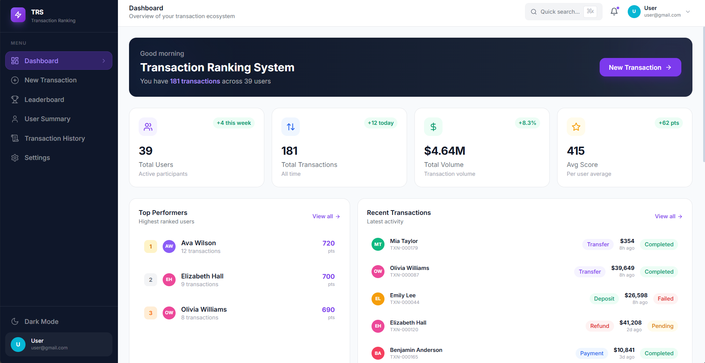

---

### Leaderboard
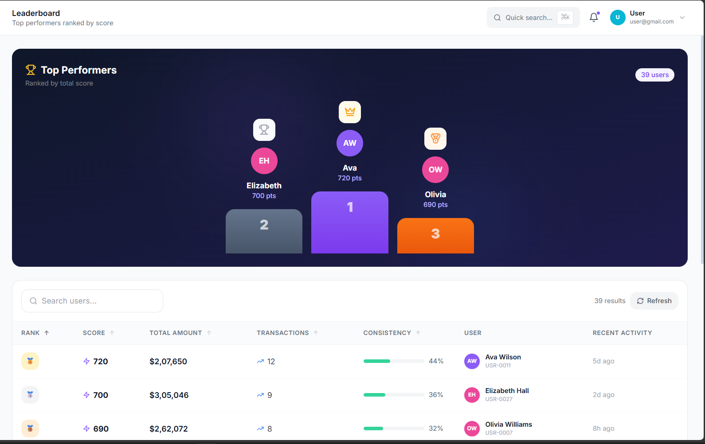

---

### New Transaction Page
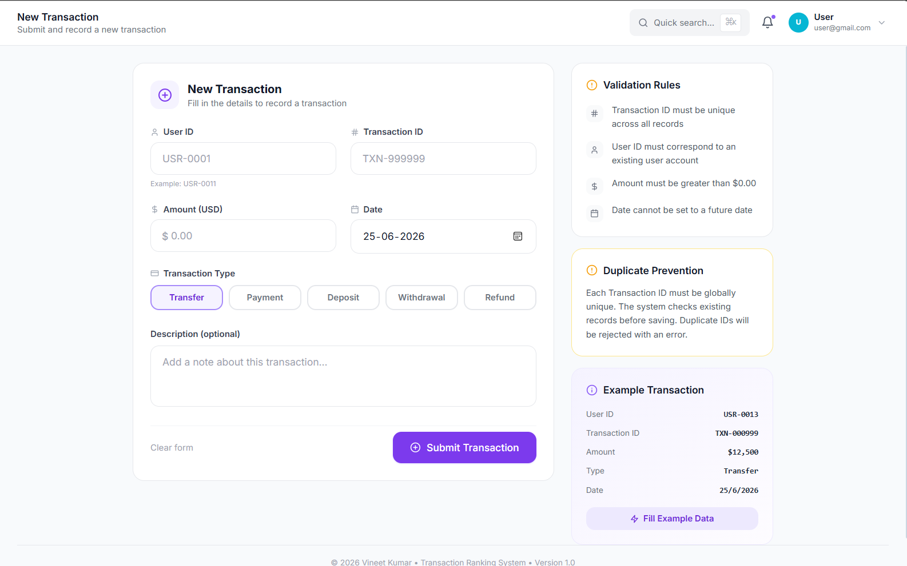

---

### User Summary
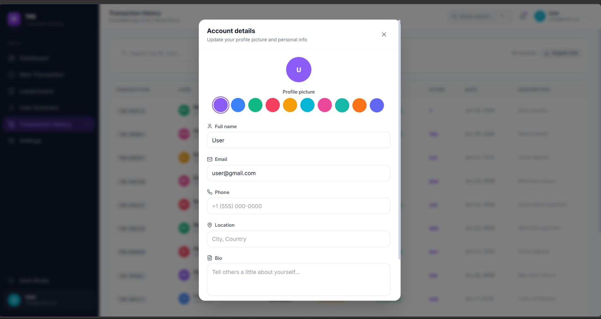

---

### Transaction History
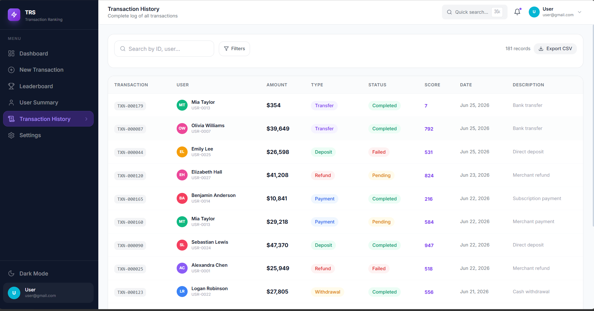

---

### Admin Dashboard
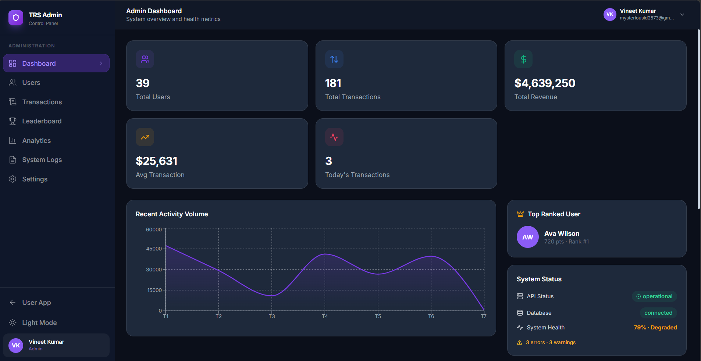

---

### Admin Users
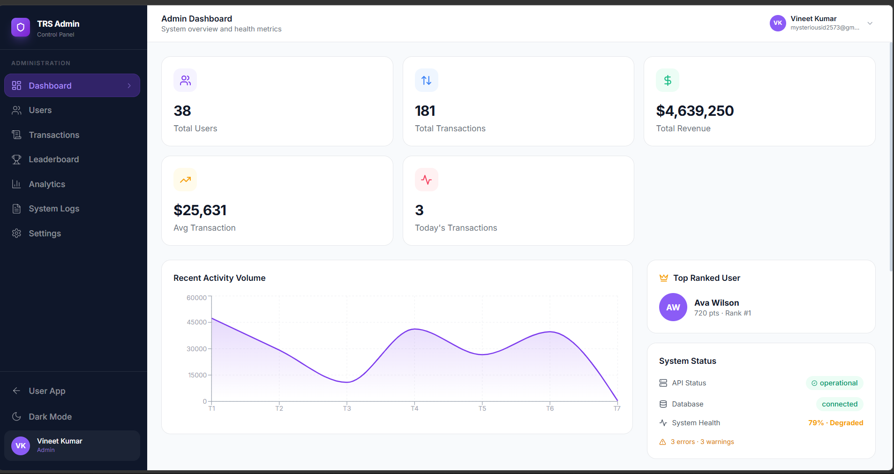

---

### Admin Analytics
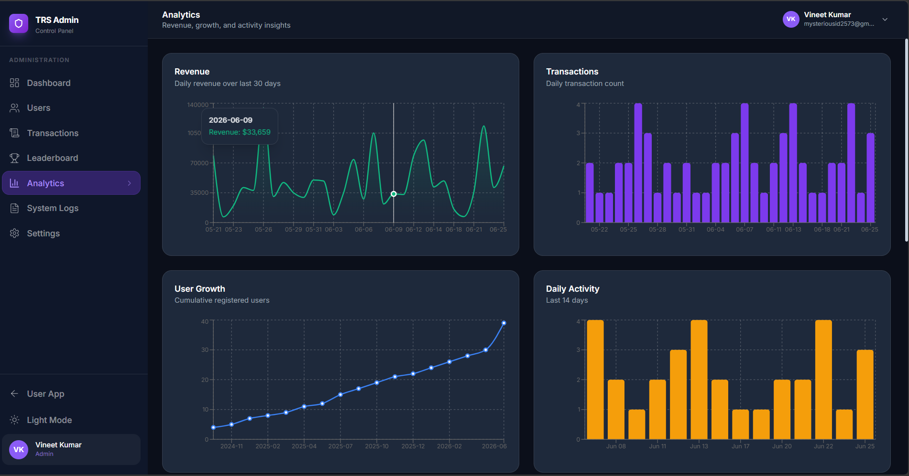

---

### Admin Transactions
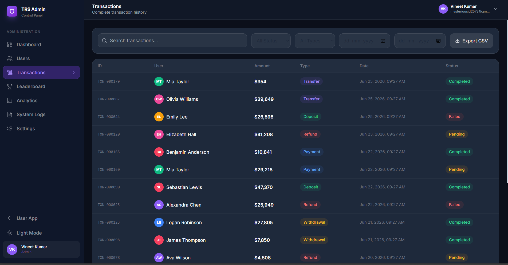

---

### Settings
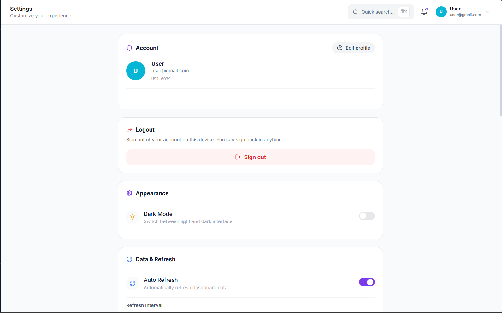

---

### Evaluation Access Expanded
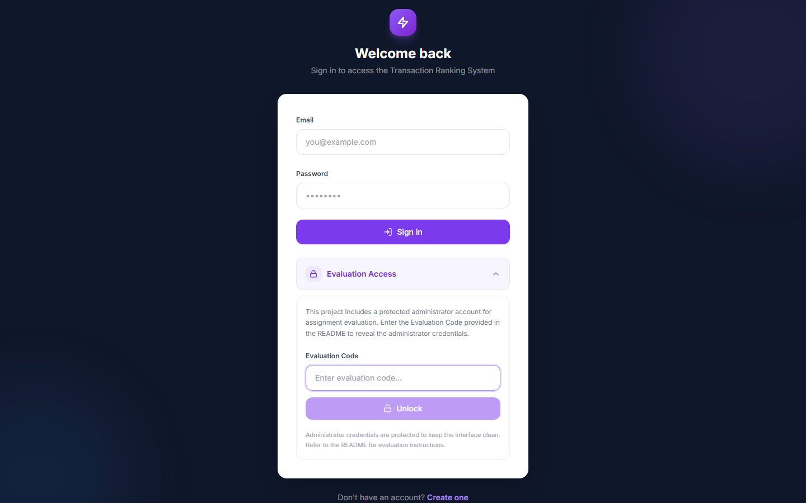

---

### Dark Theme


---

### Swagger API Documentation
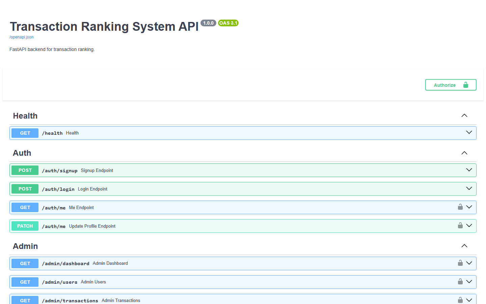

---

## 🏗️ Architecture

```
┌─────────────────┐     REST / JWT      ┌─────────────────┐
│  React Frontend │ ◄──────────────────► │  FastAPI Backend │
│  (Vite + TS)    │     /api proxy       │  (SQLAlchemy)    │
└─────────────────┘                      └────────┬────────┘
                                                  │
                                          ┌───────▼────────┐
                                          │  SQLite DB     │
                                          └────────────────┘
```

- **Frontend**: React 18, TypeScript, Tailwind CSS, Framer Motion, Recharts
- **Backend**: FastAPI, SQLAlchemy, bcrypt, python-jose (JWT)
- **Auth**: JWT Bearer tokens with role claims (`admin` | `user`)
- **Admin**: Separate route tree at `/admin/*`, protected by backend HTTP 403

---

## 💻 Tech Stack

| Layer    | Technologies                                      |
|----------|---------------------------------------------------|
| **Frontend** | React, TypeScript, Vite, Tailwind CSS, Recharts |
| **Backend**  | Python 3, FastAPI, Pydantic, SQLAlchemy, bcrypt |
| **Database** | SQLite (default, production-ready via ORM)      |
| **DevOps**   | concurrently, ESLint, PostCSS                     |

---

## ⚡ Quick Start

### Installation

```bash
# Clone the repository
git clone https://github.com/Vineet6581/transaction-ranking-system.git
cd transaction-ranking-system

# Install Frontend dependencies
npm run install:frontend

# Install Backend dependencies
pip install -r backend/requirements.txt
```

### Running the Application

```bash
# Run both Frontend and Backend concurrently
npm run dev

# Alternatively, run them separately:
npm run dev:frontend
npm run dev:backend
```

- App URL: `http://localhost:5173`
- API URL: `http://localhost:8000`
- Swagger Docs: `http://localhost:8000/docs`

---

## 🔌 API Documentation

| Method | Endpoint | Description | Auth Required |
|--------|----------|-------------|---------------|
| `POST` | `/auth/login` | Authenticate user & get JWT | No |
| `POST` | `/auth/signup` | Register new account | No |
| `GET` | `/transactions` | List all current user transactions | Yes (User) |
| `POST` | `/transaction` | Create a new transaction | Yes (User) |
| `GET` | `/ranking` | Get live leaderboard standings | Yes (User) |
| `GET` | `/admin/analytics`| System-wide chart data | Yes (Admin) |

*For a full list of endpoints, visit `http://localhost:8000/docs` after starting the server.*

---

## 🔑 Evaluation Access

For assignment evaluation purposes, administrator credentials can be revealed on the Login page:

1. Open the Login page.
2. Expand **Evaluation Access**.
3. Enter the Evaluation Code: `VINEET-TRS-2026`
4. Use the revealed credentials to access the Admin Panel.

---

## 🔮 Future Improvements

- PostgreSQL production deployment with connection pooling.
- Refresh token rotation and token revocation mechanisms.
- Real-time WebSocket updates for leaderboard.
- Docker Compose setup for one-command cloud deployment.
- End-to-end test suite using Playwright & Pytest.

---

## 👨‍💻 Developer Information

| | |
|---|---|
| **Developer** | Vineet Kumar |
| **Email** | [mysteriousid2573@gmail.com](mailto:mysteriousid2573@gmail.com) |
| **GitHub** | [github.com/Vineet6581](https://github.com/Vineet6581) |
| **LinkedIn** | [Vineet Kumar](https://www.linkedin.com/in/vineet-kumar-02634a326) |
| **Portfolio** | [vineet-dev.vercel.app](http://vineet-dev.vercel.app) |

---

<p align="center">
  <i>© 2026 Vineet Kumar · Transaction Ranking System · Version 1.0</i>
</p>
